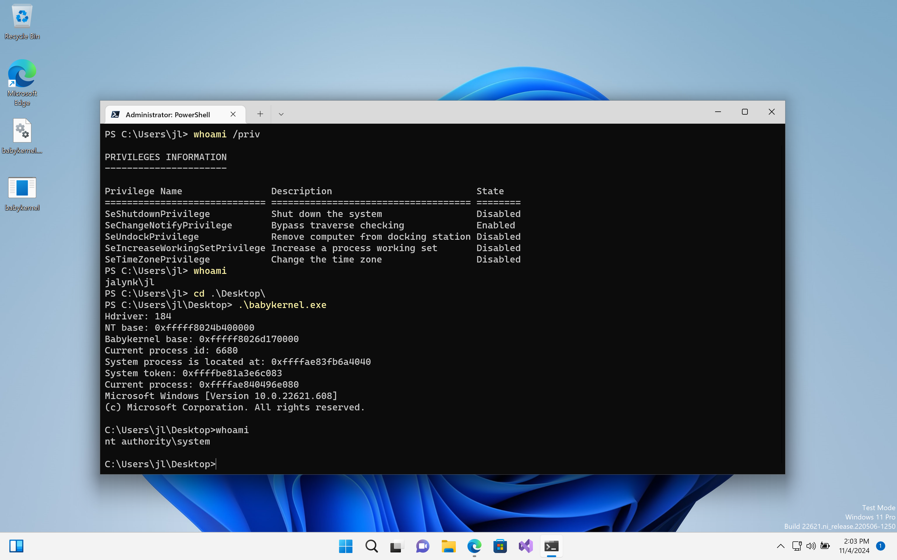

# Babykernel - MidnightSun CTF Quals 2024
Arbitrary read and arbitrary write

An absolutely easy windows kernel challenge, just use `NtQuerySystemInformation` to find `system` process, then track `current_process` from `_EPROCESS` struct, then leak `system` token and write that token into current process.

Exploit can be found at [Exploit](./babykernel.cpp)